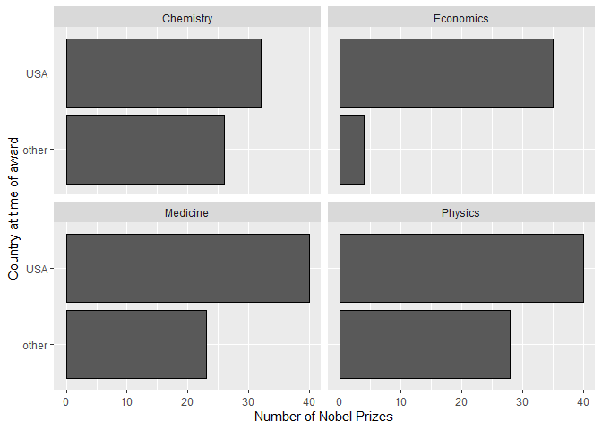
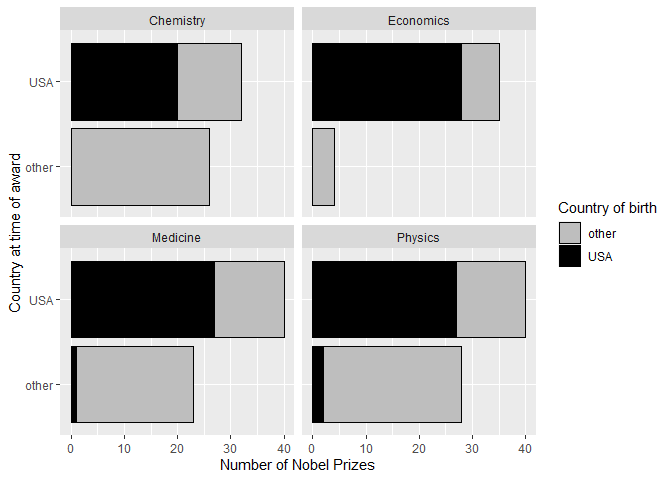

Lab 03 - Nobel laureates
================
Ben Hardin
1-23-2023

### Load packages and data

``` r
library(tidyverse) 
```

``` r
nobel <- read_csv("data/nobel.csv")
```

## Exercises

### Exercise 1

There are 26 variables and 935 observations. In this case, the
observations are people (nobel prize winning people!)

``` r
glimpse(nobel)
```

    ## Rows: 935
    ## Columns: 26
    ## $ id                    <dbl> 1, 2, 3, 4, 5, 6, 6, 8, 9, 10, 11, 12, 13, 14, 1…
    ## $ firstname             <chr> "Wilhelm Conrad", "Hendrik A.", "Pieter", "Henri…
    ## $ surname               <chr> "Röntgen", "Lorentz", "Zeeman", "Becquerel", "Cu…
    ## $ year                  <dbl> 1901, 1902, 1902, 1903, 1903, 1903, 1911, 1904, …
    ## $ category              <chr> "Physics", "Physics", "Physics", "Physics", "Phy…
    ## $ affiliation           <chr> "Munich University", "Leiden University", "Amste…
    ## $ city                  <chr> "Munich", "Leiden", "Amsterdam", "Paris", "Paris…
    ## $ country               <chr> "Germany", "Netherlands", "Netherlands", "France…
    ## $ born_date             <date> 1845-03-27, 1853-07-18, 1865-05-25, 1852-12-15,…
    ## $ died_date             <date> 1923-02-10, 1928-02-04, 1943-10-09, 1908-08-25,…
    ## $ gender                <chr> "male", "male", "male", "male", "male", "female"…
    ## $ born_city             <chr> "Remscheid", "Arnhem", "Zonnemaire", "Paris", "P…
    ## $ born_country          <chr> "Germany", "Netherlands", "Netherlands", "France…
    ## $ born_country_code     <chr> "DE", "NL", "NL", "FR", "FR", "PL", "PL", "GB", …
    ## $ died_city             <chr> "Munich", NA, "Amsterdam", NA, "Paris", "Sallanc…
    ## $ died_country          <chr> "Germany", "Netherlands", "Netherlands", "France…
    ## $ died_country_code     <chr> "DE", "NL", "NL", "FR", "FR", "FR", "FR", "GB", …
    ## $ overall_motivation    <chr> NA, NA, NA, NA, NA, NA, NA, NA, NA, NA, NA, NA, …
    ## $ share                 <dbl> 1, 2, 2, 2, 4, 4, 1, 1, 1, 1, 1, 1, 2, 2, 1, 1, …
    ## $ motivation            <chr> "\"in recognition of the extraordinary services …
    ## $ born_country_original <chr> "Prussia (now Germany)", "the Netherlands", "the…
    ## $ born_city_original    <chr> "Lennep (now Remscheid)", "Arnhem", "Zonnemaire"…
    ## $ died_country_original <chr> "Germany", "the Netherlands", "the Netherlands",…
    ## $ died_city_original    <chr> "Munich", NA, "Amsterdam", NA, "Paris", "Sallanc…
    ## $ city_original         <chr> "Munich", "Leiden", "Amsterdam", "Paris", "Paris…
    ## $ country_original      <chr> "Germany", "the Netherlands", "the Netherlands",…

### Exercise 2

This code makes a new dataframe which contains only nobel laureates who
(1) have country data available, (2) are people and not organizations, &
(3) are still alive. By glimpsing at the data, we confirm that the new
dataframe contains 228 people.

``` r
nobel_living <- nobel %>%
  filter(
    !is.na(country),
    gender != "org",
    is.na(died_date))

#verifying this code worked
glimpse(nobel_living)
```

    ## Rows: 228
    ## Columns: 26
    ## $ id                    <dbl> 68, 69, 95, 97, 98, 99, 101, 103, 106, 107, 111,…
    ## $ firstname             <chr> "Chen Ning", "Tsung-Dao", "Leon N.", "Leo", "Iva…
    ## $ surname               <chr> "Yang", "Lee", "Cooper", "Esaki", "Giaever", "Jo…
    ## $ year                  <dbl> 1957, 1957, 1972, 1973, 1973, 1973, 1974, 1975, …
    ## $ category              <chr> "Physics", "Physics", "Physics", "Physics", "Phy…
    ## $ affiliation           <chr> "Institute for Advanced Study", "Columbia Univer…
    ## $ city                  <chr> "Princeton NJ", "New York NY", "Providence RI", …
    ## $ country               <chr> "USA", "USA", "USA", "USA", "USA", "United Kingd…
    ## $ born_date             <date> 1922-09-22, 1926-11-24, 1930-02-28, 1925-03-12,…
    ## $ died_date             <date> NA, NA, NA, NA, NA, NA, NA, NA, NA, NA, NA, NA,…
    ## $ gender                <chr> "male", "male", "male", "male", "male", "male", …
    ## $ born_city             <chr> "Hofei Anhwei", "Shanghai", "New York NY", "Osak…
    ## $ born_country          <chr> "China", "China", "USA", "Japan", "Norway", "Uni…
    ## $ born_country_code     <chr> "CN", "CN", "US", "JP", "NO", "GB", "GB", "US", …
    ## $ died_city             <chr> NA, NA, NA, NA, NA, NA, NA, NA, NA, NA, NA, NA, …
    ## $ died_country          <chr> NA, NA, NA, NA, NA, NA, NA, NA, NA, NA, NA, NA, …
    ## $ died_country_code     <chr> NA, NA, NA, NA, NA, NA, NA, NA, NA, NA, NA, NA, …
    ## $ overall_motivation    <chr> NA, NA, NA, NA, NA, NA, NA, NA, NA, NA, NA, NA, …
    ## $ share                 <dbl> 2, 2, 3, 4, 4, 2, 2, 3, 2, 3, 4, 4, 3, 3, 2, 1, …
    ## $ motivation            <chr> "\"for their penetrating investigation of the so…
    ## $ born_country_original <chr> "China", "China", "USA", "Japan", "Norway", "Uni…
    ## $ born_city_original    <chr> "Hofei Anhwei", "Shanghai", "New York NY", "Osak…
    ## $ died_country_original <chr> NA, NA, NA, NA, NA, NA, NA, NA, NA, NA, NA, NA, …
    ## $ died_city_original    <chr> NA, NA, NA, NA, NA, NA, NA, NA, NA, NA, NA, NA, …
    ## $ city_original         <chr> "Princeton NJ", "New York NY", "Providence RI", …
    ## $ country_original      <chr> "USA", "USA", "USA", "USA", "USA", "United Kingd…

### Exercise 3

This code chunk creates the dataset that we need to answer the question
in Exercise 3, showing how many nobel laureates in the sciences were
based in the US or somewhere else when they got their prize.

``` r
#creating USA variable
nobel_living <- nobel_living %>%
  mutate(country_us = if_else(country == "USA", "USA", "other"))

#filtering for sciences
nobel_living_science <- nobel_living %>%
  filter(category %in% c("Physics", "Medicine", "Chemistry", "Economics"))
```

The visualization shows that, generally, nobel prizes for the sciences
have more often been awarded to people living in the US than people
living elsewhere. This difference is the greatest for Economics, while
the difference is smallest for Chemistry. This supports Buzzfeed’s claim
that “Most living Nobel laureates in the sciences are based in the US.”

``` r
ggplot(data = nobel_living_science,
       aes(x = country_us))+
  geom_bar(color = "black")+
  facet_wrap(~ category)+
  coord_flip()+
  labs(y = "Number of Nobel Prizes",
       x = "Country at time of award")
```

<!-- -->
\### Exercise 4

The code below creates a new variable that indicates whether a nobel
laureate was born in the US or in another country. 105 Nobel prize
winners in the sciences were born in the US.

``` r
nobel_living_science <- nobel_living_science %>%
  mutate(born_country_us = if_else(born_country == "USA", "USA", "other"))

#getting born in the usa count
nobel_living_science %>%
  count(born_country_us)
```

    ## # A tibble: 2 × 2
    ##   born_country_us     n
    ##   <chr>           <int>
    ## 1 other             123
    ## 2 USA               105

### Exercise 5

The bar plots below show that, of those Nobel laureates who were living
in the US when they received their award, about 1/3 to 1/6 of them
(depending on the specific field) were born in another country. This
could either support or not support Buzzfeed’s claim that “many
\[US-based Nobel laureates\] were born in other countries”, depending on
how “many” is defined. It is true based on this graph that Nobel
laureates are much more likely to have immigrated to the US from another
country than vice versa, and it is true that a sizeable chunk of
American Nobel laureates are immigrants. On the other hand, if we
misunderstood Buzzfeed’s claim to be that MOST American Nobel laureates
immigrated to the US from other countries, then these data would not
support that claim.

``` r
ggplot(data = nobel_living_science,
       aes(x = country_us,
           fill = born_country_us))+
  geom_bar(color = "black", position = "stack")+
  scale_fill_manual(values = c("grey", "black"))+
  facet_wrap(~ category)+
  coord_flip()+
  labs(y = "Number of Nobel Prizes",
       x = "Country at time of award",
       fill = "Country of birth")
```

<!-- -->

### Exercise 6

This code shows us where those American nobel laureates who immigrated
from other countries were originally born. The two most common countries
are Germany and the UK.

``` r
nobel_living_science %>%
  filter(country_us == "USA", born_country_us == "other") %>%
  count(born_country) %>%
  arrange(desc(n))
```

    ## # A tibble: 21 × 2
    ##    born_country       n
    ##    <chr>          <int>
    ##  1 Germany            7
    ##  2 United Kingdom     7
    ##  3 China              5
    ##  4 Canada             4
    ##  5 Japan              3
    ##  6 Australia          2
    ##  7 Israel             2
    ##  8 Norway             2
    ##  9 Austria            1
    ## 10 Finland            1
    ## # … with 11 more rows
